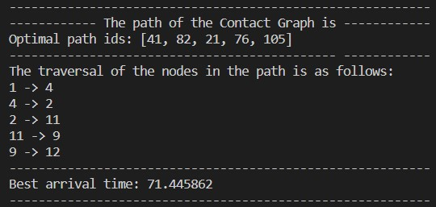

# Contact Graphs: A new way of communication for a space internet

## Goal of the project
In this project we are supposed to implement the Dijkstra algorithm as outlined in the paper attached. <br>
The goal of this project is to implement the Dijkstra algorithm on contact graphs as explained in
Algorithm 1, Algorithm 2, and Algorithm 3 in section 4 of the paper. Dijkstra tries to find a valid
path in the contact graph minimizing the “arrival time” as its metric (which corresponds to the
“path cost” in regular Dijkstra)

## Problem Statement
In the original paper, the authors, for one of the algorithms, namely the Contact Selection Procedure, use a linear search. We must replace this linear search aspect of the algorithm and impelement a **Minimum Priority Queue** using Heaps.

## Approach
In this approach, I have used one heap of all the contact plans and pop them out based on the arrival times, thus eliminating the need for two different functions.

## Dependencies and libraries
1. Python 3 version 3.9.12
2. Typing
3. Queue

## Usage
1. Download the files onto your computer
2. Ensure that the 'ContactList.txt' files is in the same directory as the python file
3. Open the terminal in that directory either in Ubuntu or from any terminal is your IDE of choice.
4. Run the code as follows
```
python contact_graph.py
```
4. The program will run and provide the following output

## Output
